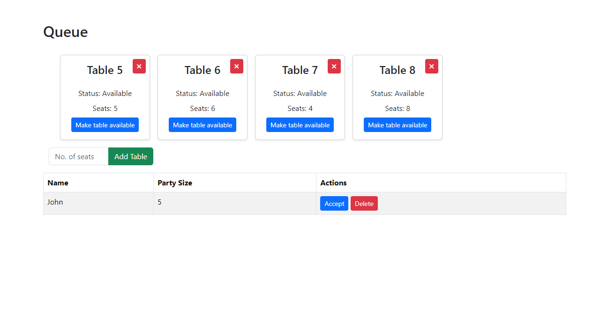
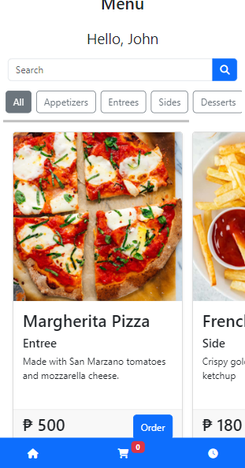
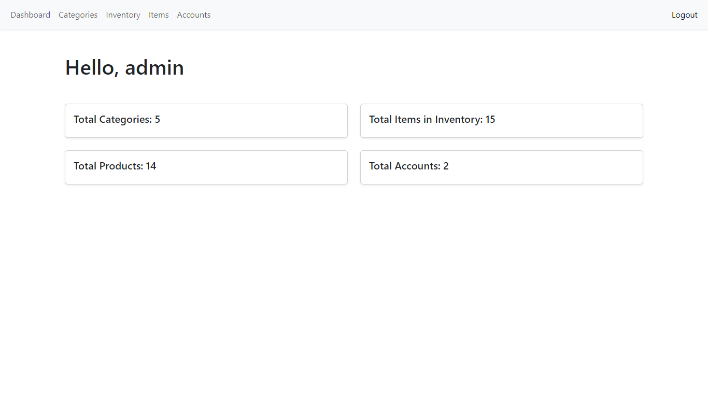

# 🍽️ ROQS

ROQS (Restaurant Ordering and Queuing System) is a web-based application designed to streamline restaurant operations. It provides tools for managing tables, customer queues, orders, inventory, and staff accounts, offering both staff and customer interfaces for efficient service.

## 🖼️ Screenshots

### Table Management

### Menu

### Admin Dashboard

## ✨ Features

- 🪑 **Table & Queue Management:** Track table status and manage customer queues in real time.
- 📝 **Order Handling:** Place, update, and monitor orders with detailed item breakdowns.
- 📦 **Inventory Control:** Manage menu items, categories, and stock levels.
- 👥 **User Accounts:** Staff authentication and role-based access.
- 📊 **Dashboard:** Visual overview of restaurant activity and key metrics.
- 💻 **Responsive Interface:** User-friendly design for both desktop and mobile devices.

## 🚀 Installation Guide

1. Clone or download this repository.
2. Import the database:
   - Create a new MySQL database.
   - Import `sql/roqs.sql` using your preferred MySQL tool.
3. Configure your web server:
   - Set the document root to the `public/` directory.
   - Ensure PHP and MySQL are installed and configured.
4. Update database connection settings in the configuration file (if applicable).
5. Access the application via your browser.

## 📁 Project Structure

- `assets/` - CSS, JavaScript, and image assets.
- `public/` - PHP endpoints and main web pages.
- `sql/roqs.sql` - Database schema and seed data.
- `src/` - Application source code (backend logic).
- `README.md` - Project documentation.

## 📝 Note

This project was created as part of my Software Engineering 1 course during my 3rd year in college, and was submitted on December 12, 2023.
